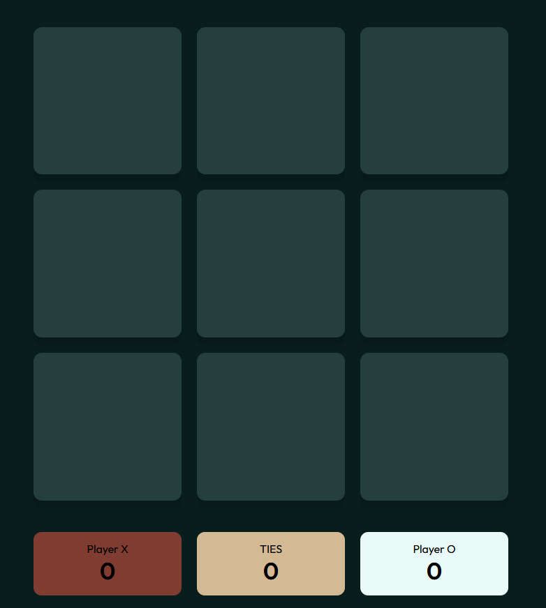
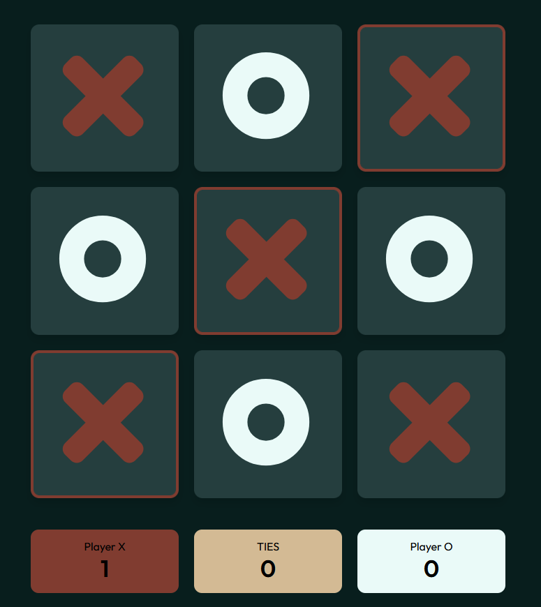

# tictactoe

## Overview
Everyone builds this at some point in their career. Here is me walking down the path laid by those before me. If I keep walking, I might get where they are, get as cracked as some of the people I read about.

This project solidified my understanding of Javascript functions and abstraction. Interesting colors, clean looking tictactoe. Completely overdoing a simple task.

## Features

- It works
- It looks beautiful (i think so)
- It's tictactoe

## Live Demo

Click [here](https://omkharade.github.io/odin-tictactoe/) to play

## More Projects

[This](https://github.com/OmKharade/odin-library) is what I tried next

#### Visit my [GitHub Profile](https://github.com/OmKharade). Feedback is very appreciated !

